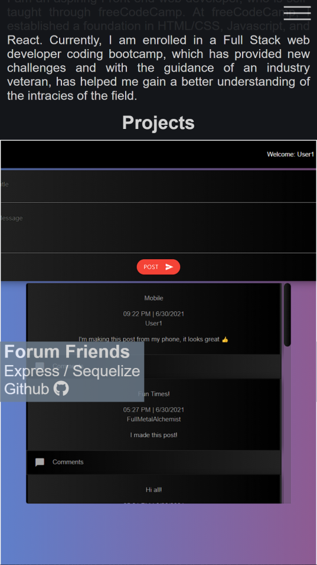

# My Professional Web Dev Portfolio (Updated #2)

## Overview

For this exercise, the user was tasked with creating a mock professional portfolio using previously acquired HTML and CSS skills. An emphasis was placed on internal hyperlinks and responsive design. It was essential to use flexbox to ensure that the site work appropriately for smaller screen sizes.

## Table of Content

  - [Features](#features)
  - [Installation](#installation)
  - [Usage](#usage)
  - [Technologies Used](#technologies-used)
  - [Links](#links)
  - [Resources](#resources)
  - [Screenshot](#screenshot)
    - [Updated Mobile version of website (07-01-2021)](#updated-mobile-version-of-website-07-01-2021)
    - [Updated Desktop version of website (07-01-2021)](#updated-desktop-version-of-website-07-01-2021)
    - [Updated Desktop version of website (06-01-2021)](#updated-desktop-version-of-website-06-01-2021)

## Features

- Internal and external links
- Flexbox
- Media queries
- Hover pseudo-class
- Font Awesome Icons

## Installation

- Git clone the repository.
- Open `index.html` in a browser of your choice.

## Usage

- Click on the links to view corresponding content.

## Technologies Used

- HTML
- CSS
- JavaScript

## Links

- [Deployed Link](https://huirayj.github.io/professional-portfolio/)
- [Github Repository](https://github.com/huirayj/professional-portfolio)

## Resources

- https://www.w3schools.com/tags/att_a_href.asp
- https://developer.mozilla.org/en-US/docs/Web/CSS/Pseudo-classes
- https://css-tricks.com/snippets/css/a-guide-to-flexbox/
- https://developer.mozilla.org/en-US/docs/Web/CSS/Media_Queries/Using_media_queries

## Screenshot

### Updated Mobile version of website (07-01-2021)

### Updated Desktop version of website (07-01-2021)

### Updated Desktop version of website (06-01-2021)

